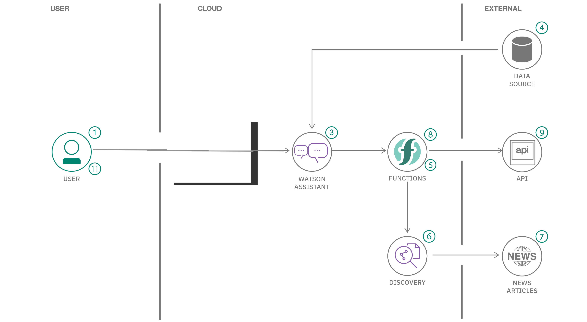
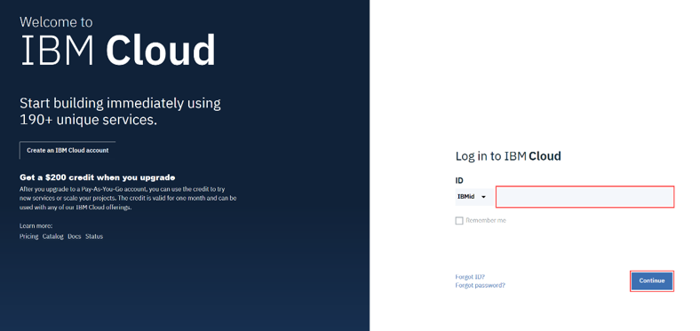
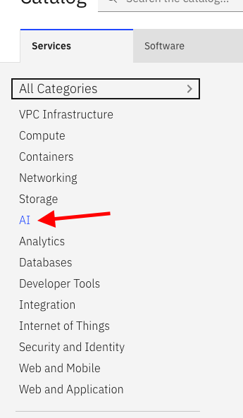
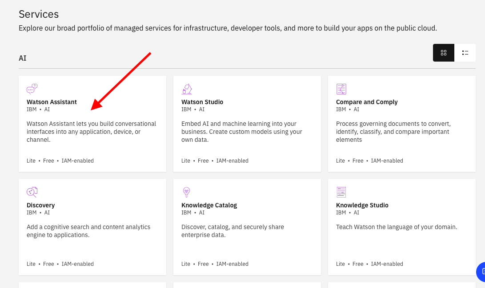
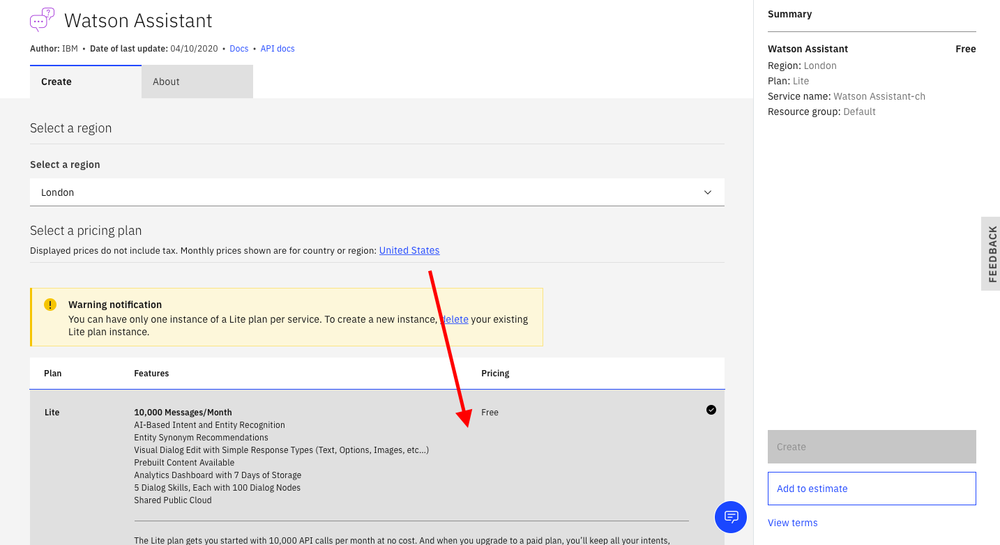
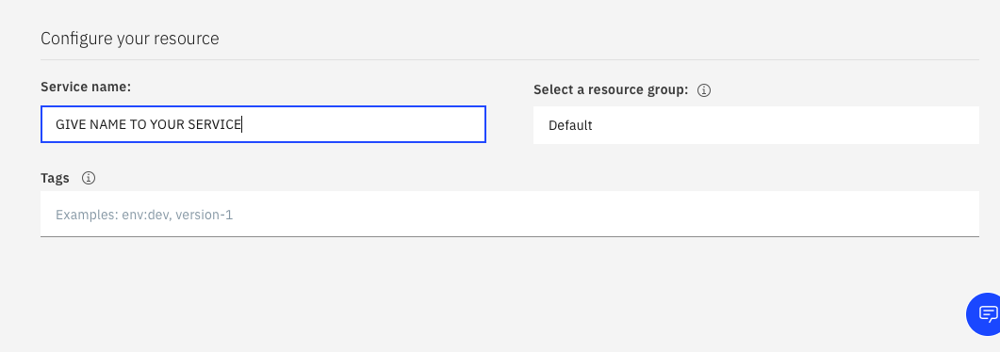
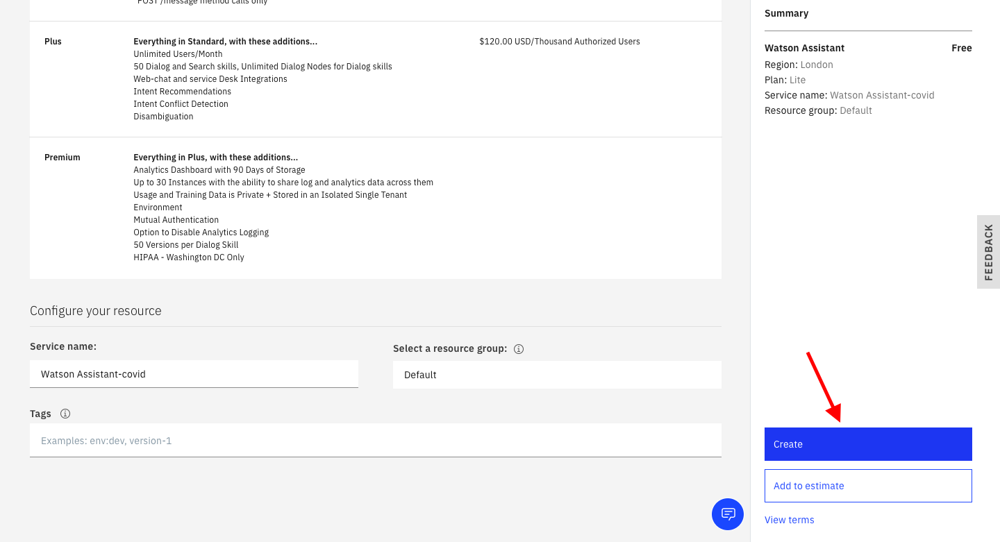
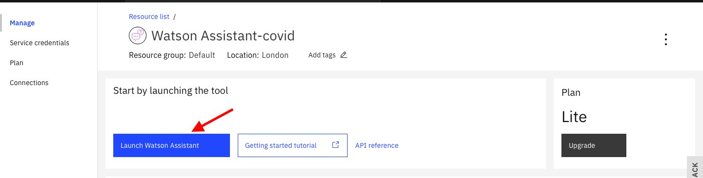
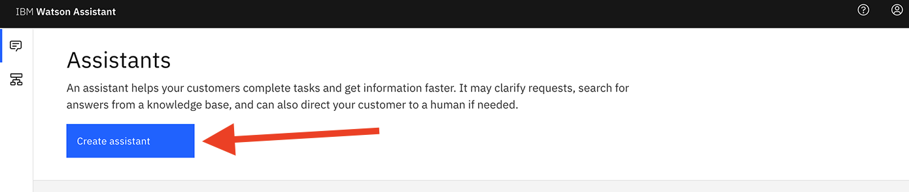

# ibmwatson-chatbot
This repo has the step to create a IBM Watson chatbot and deploy it . 

# Creating a bot with skill kit - code posted by IBM
 # Covid-19 Bot 
 
 ### What we gone do: 
*Provision an instance of Watson Assistant

*Add a dialog skill to your Watson Assistant instance

*Connect your Watson Assistant with Watson Discovery

*Create Cloud Functions

### IBM technology used:

* IBM Watson Assistant
* Watson Discovery
* Watson Speech to Text
* Watson Text to Speech
* IBM Cloud Functions

http://

# Let's Start :smile:

# Prerequisite

*  IBM Cloud account - may be lite or paid plan . 

# Step 1 : Set up an instance of Watson Assistant

1. Log in to IBM cloud using your credintials. Link-> https://cloud.ibm.com/login

   If you have no IBM cloud account. press https://cloud.ibm.com/registration to register.
         
2. After Siging-In go to the IBM Cloud "catalog" on top of the window , to provision an an instance of Watson Assistant. 

### Click AI inside the catalog side panel 

### Click Watson Assistant 

### Click "Lite" in plan , region as London 

### Give name to your service or leave it as it is 

### Click create 

### Click lauch assistant

3. Name the Watson Assistant instance "COVID Crisis Communication "

4.  Click Add Dialog skill to add this to your assistant

5. Click Import skill -> Choose JSON file and import the "COVID-FAQ.json" file. 

