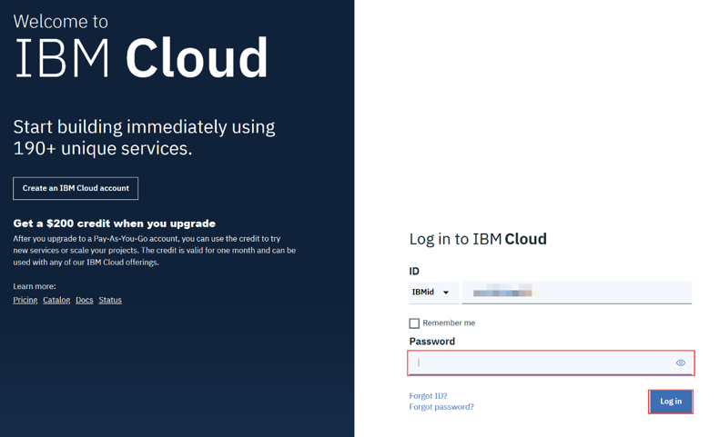
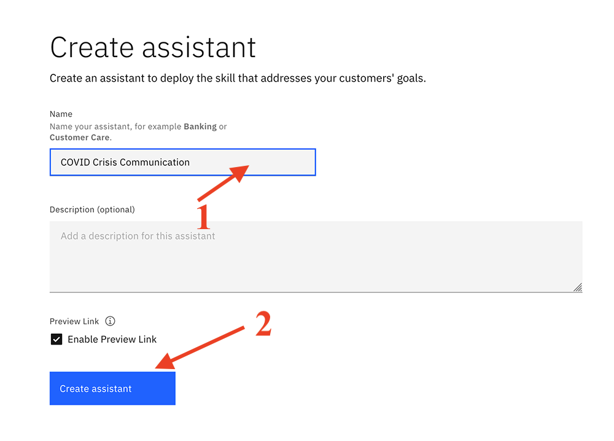
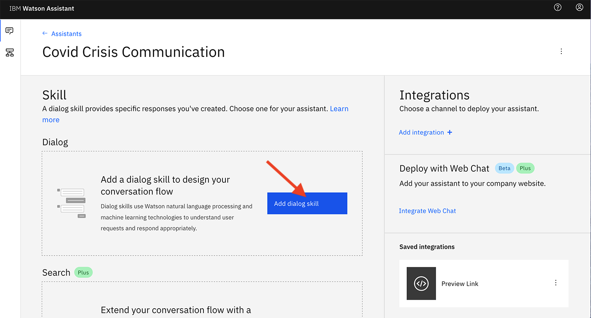
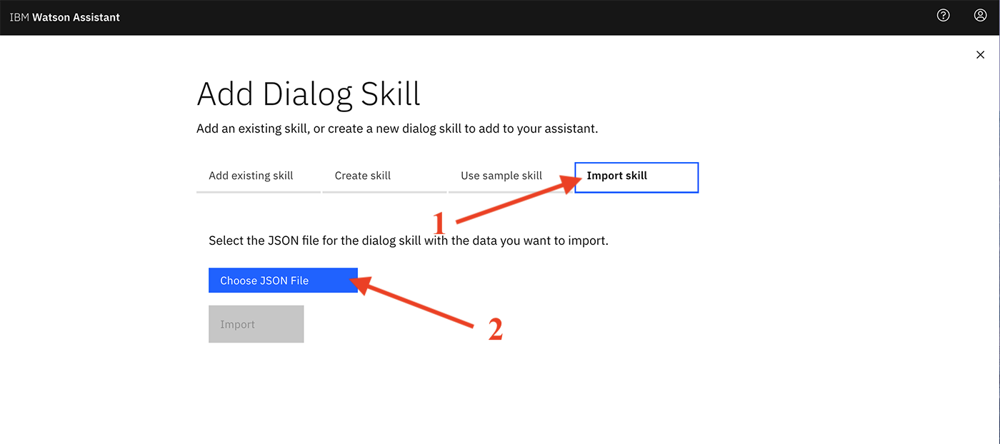
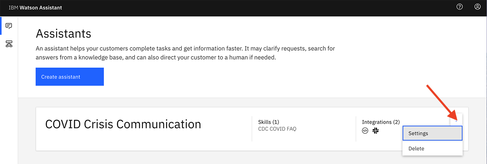
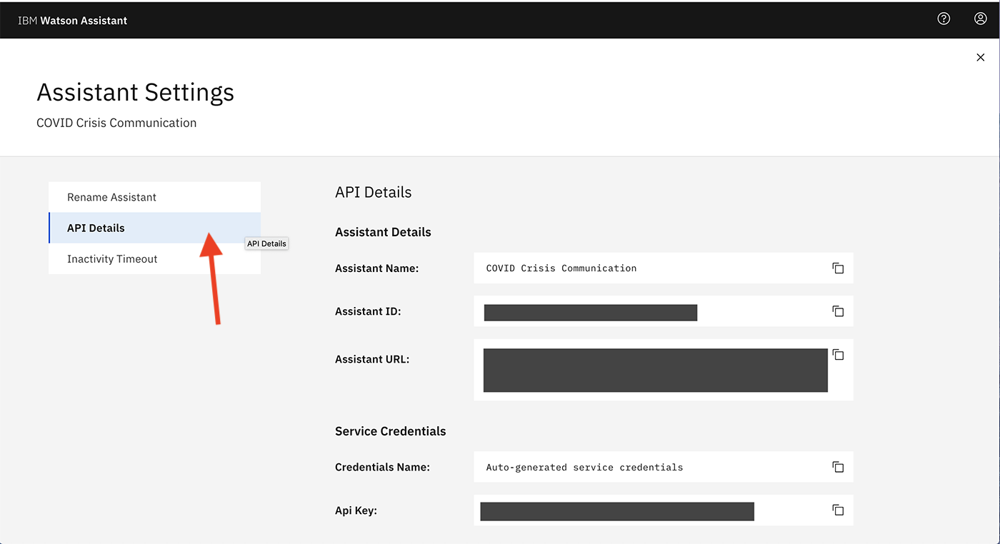
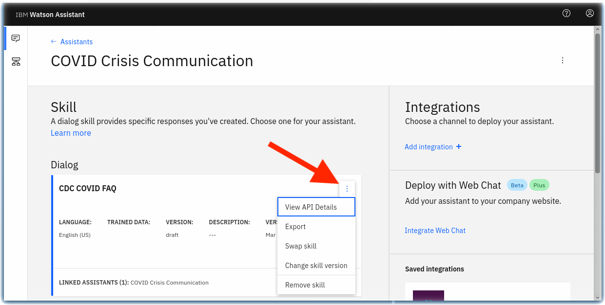
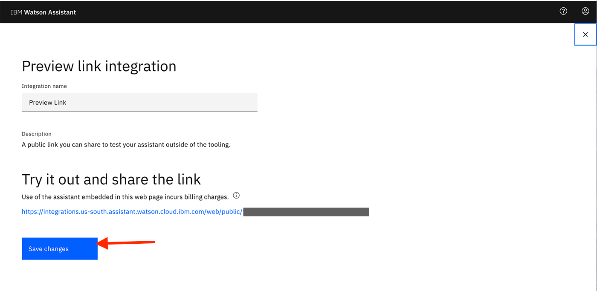

# IBM Watson-chatbot
This repo has the step to create a IBM Watson chatbot and deploy it . 

# Creating a bot with skill kit - code posted by IBM
 # Covid-19 Bot 
 
 ### What we gone do: 
*Provision an instance of Watson Assistant

*Add a dialog skill to your Watson Assistant instance

*Connect your Watson Assistant with Watson Discovery

*Create Cloud Functions

### IBM technology used:

* IBM Watson Assistant
* Watson Discovery
* Watson Speech to Text
* Watson Text to Speech
* IBM Cloud Functions

http://

# Let's Start :smile:

# Prerequisite

*  IBM Cloud account - may be lite or paid plan . 

# Step 1 : Set up an instance of Watson Assistant

1. Log in to IBM cloud using your credintials. Link-> https://cloud.ibm.com/login

   If you have no IBM cloud account. press https://cloud.ibm.com/registration to register.
         
2. After Siging-In go to the IBM Cloud "catalog" on top of the window , to provision an an instance of Watson Assistant. 

### Click AI inside the catalog side panel 

### Click Watson Assistant 

### Click "Lite" in plan , region as London 

### Give name to your service or leave it as it is 

### Click create 

### Click lauch assistant

3. Name the Watson Assistant instance "COVID Crisis Communication "

4.  Click Add Dialog skill to add this to your assistant

5. Click Import skill -> Choose JSON file and import the "COVID-FAQ.json" file. 

6. Go back to the All Assistants page (click x mark on top right) .Then click the action menu ( ⋮ ), click Settings.

7. On the Settings tab, click API Details on the left and make a note of the Assistant ID and Api Key for future use.

8. Go back to the All Assistants page (click x mark ) and click on the Skills link . 

9.  On the Skill page, click on the action menu ( ⋮ ), open View API Details. 

10. On the Skill Details page, make note of the Skill ID for future use. 

11.  Go back to your dialog skill and click on the Preview Link button on the side to get a link to test and verify your assistant. 

12. Ask the Watson Assistant chatbot some questions about COVID-19.

# You have successfully created a Covid-19 chatbot IBM Watson Assistance .

